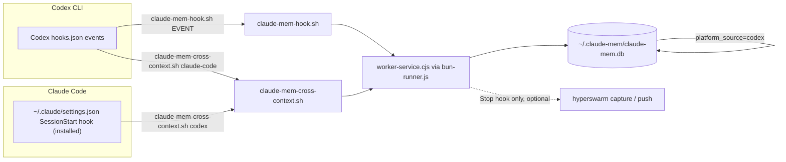

# Architecture overview

This plugin has no server and no database of its own. It is a set of thin POSIX shell adapters
that translate CLI lifecycle events into calls against an already-installed claude-mem worker, and
one Python installer that wires the Claude Code half of the loop.

## Discovery, not vendoring

Every adapter script (`claude-mem-hook.sh`, `claude-mem-cross-context.sh`) implements the same two
lookups before doing anything:

- **`find_claude_mem`** — prefers `CLAUDE_MEM_PLUGIN_ROOT` if set and valid, otherwise searches the
  newest versioned directory under `~/.claude/plugins/cache/thedotmack/claude-mem` or
  `~/.codex/plugins/cache/thedotmack/claude-mem`, falling back to
  `~/.claude/plugins/marketplaces/thedotmack/plugin`. It only accepts a candidate that has
  `scripts/worker-service.cjs`.
  ([claude-mem-hook.sh:6-28](../plugins/claude-mem-codex/scripts/claude-mem-hook.sh))
- **`find_node`** — prefers `CLAUDE_MEM_NODE` if executable, otherwise `command -v node`, then a
  list of common install paths, then the newest nvm-managed Node.
  ([claude-mem-hook.sh:30-56](../plugins/claude-mem-codex/scripts/claude-mem-hook.sh))

If either lookup fails, the script exits `0` silently — see
[workflows/hook-lifecycle.md](../workflows/hook-lifecycle.md) for why "fail open" is a hard
requirement here, not an oversight. `plugins/claude-mem-codex/.mcp.json` runs the same
root-discovery logic inline (as a one-line Node script) to launch `mcp-server.cjs` for the
`mcp-search` MCP server that exposes claude-mem's search/timeline/observation tools directly to
the model.

## One database, two writers, one attribution field

Both CLIs write into the same `~/.claude-mem/claude-mem.db` through the same worker
(`worker-service.cjs hook <platform> <event>`), and the worker is expected to stamp each record
with `platform_source` (`claude` or `codex`). This repo never opens or migrates that database
directly — `AGENTS.md` explicitly treats it as upstream-owned state
([AGENTS.md:4](../AGENTS.md)).

Cross-recall means each CLI's native `SessionStart` hook loads its own source *and* invokes the
opposite adapter to load the other source — e.g. Codex's `SessionStart` runs both
`claude-mem-hook.sh context` (native) and `claude-mem-cross-context.sh claude-code`
(cross-recall), matching [hooks.json](../plugins/claude-mem-codex/hooks/hooks.json).

## HyperSwarm: optional downstream layer

`claude-mem-stop.sh` — the only script bound to the `Stop` event — runs claude-mem's own
summarization synchronously first, then, only if a `hyperswarm` binary is found, detaches a
background subshell that runs `hyperswarm capture --runtime claude_mem_session` followed by
`hyperswarm push`. This ordering exists so HyperSwarm's significance gate always reads a
*finished* claude-mem session summary rather than racing it, and so HyperSwarm's own network calls
can never blow the Codex Stop-hook timeout (introduced in
[85f850c](https://github.com/teamnebula-ai/claude-mem-codex/commit/85f850c), hardened in
[fbf25f2](https://github.com/teamnebula-ai/claude-mem-codex/commit/fbf25f2)). If HyperSwarm's own
significance-gate check itself shells out via `codex exec`, that child process is marked
`CODEX_NO_INTERACTIVE=1` and the script exits before touching HyperSwarm again, preventing
recursive self-feeding. See
[workflows/hook-lifecycle.md](../workflows/hook-lifecycle.md#stop-the-race-that-must-not-happen)
for the full sequencing.

## Relationships

- **dispatches to** [workflows/hook-lifecycle.md](../workflows/hook-lifecycle.md) — per-event
  detail of what each hook actually does.
- **installed by** [workflows/installer.md](../workflows/installer.md) — the Claude Code
  `SessionStart` hook shown above is placed by the Python installer, not by a package manager.
