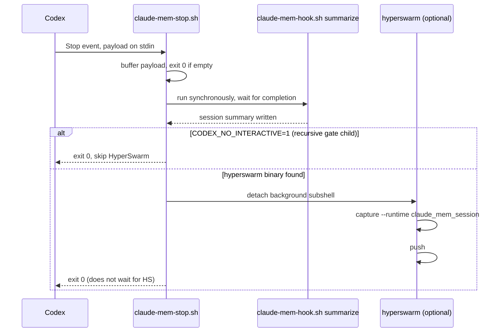

# Hook lifecycle

`plugins/claude-mem-codex/hooks/hooks.json` binds five Codex lifecycle events. Each maps to one
shell adapter, which in turn calls `worker-service.cjs hook codex <event>` (or `hook <platform>
context` for cross-recall).

| Event | Matcher | Script + args | Timeout |
|---|---|---|---|
| `SessionStart` | `startup\|resume` | `claude-mem-hook.sh context` | 60s |
| `SessionStart` | `startup\|resume` | `claude-mem-cross-context.sh claude-code` | 60s |
| `UserPromptSubmit` | — | `claude-mem-hook.sh session-init` | 60s |
| `PreToolUse` | `^Bash$\|^mcp__.+__(read\|view\|cat)(_file\|_files)?$` | `claude-mem-hook.sh file-context` | 30s |
| `PostToolUse` | `.*` | `claude-mem-hook.sh observation` | 120s |
| `Stop` | — | `claude-mem-stop.sh` | 180s |

([hooks.json](../plugins/claude-mem-codex/hooks/hooks.json))

On `SessionStart`, Codex loads its own memory (`claude-mem-hook.sh context`) *and* the Claude Code
side (`claude-mem-cross-context.sh claude-code`) in the same event — that's the "symmetric" half
of cross-recall described in [architecture/overview.md](../architecture/overview.md). The other
half — Claude Code loading Codex's memory — comes from the `SessionStart` hook that
`install-claude-cross-recall.py` adds to `~/.claude/settings.json` (see
[workflows/installer.md](installer.md)); it calls the same `claude-mem-cross-context.sh` script
with `codex` as the platform argument.

## Fail-open contract

`claude-mem-hook.sh` and `claude-mem-cross-context.sh` share the same shape and the same
guarantee: a missing dependency or bad input must never fail the Codex lifecycle event that
invoked them.

1. Resolve `find_claude_mem` and `find_node` (see
   [architecture/overview.md](../architecture/overview.md#discovery-not-vendoring)) — exit `0`
   immediately if either is missing.
2. Buffer stdin to a temp file; exit `0` if it's empty (`[ -s "$payload" ]`).
   ([claude-mem-hook.sh:71-78](../plugins/claude-mem-codex/scripts/claude-mem-hook.sh))
3. Buffer the runner's stdout to a second temp file and only `cat` it to real stdout if the runner
   exits `0` — a partial/invalid JSON response from a crashed runner is discarded rather than
   corrupting the hook's output.
4. Clean up temp files via `trap ... EXIT HUP INT TERM`.

This buffering was added specifically to close two failure modes: an empty Codex payload silently
producing garbage, and a crashed `worker-service.cjs` run leaking partial JSON onto stdout
(fixed in [fbf25f2](https://github.com/teamnebula-ai/claude-mem-codex/commit/fbf25f2), see
`tests/test_installer.py::test_hook_wrappers_fail_open_on_empty_input_or_runner_failure`).

## Stop: the race that must not happen

`claude-mem-stop.sh` is the one script not shaped like the other two, because Codex can invoke
matching `Stop` hooks concurrently and this one has two sequential dependents:

The ordering is load-bearing: HyperSwarm's significance gate reads the *just-written* claude-mem
session summary, so `summarize` must finish before `capture` starts
(`claude-mem-stop.sh:13,38` — asserted directly by
`test_stop_hook_sequences_summary_before_optional_hyperswarm`, which checks `summary_pos <
capture_pos < push_pos` in the script text). The `capture`/`push` pair runs in a detached
background subshell (trailing `&`) specifically so HyperSwarm's own model/network latency cannot
turn a successful Codex turn into a Stop-hook timeout. The `CODEX_NO_INTERACTIVE=1` guard prevents
HyperSwarm's own gate check (which may itself shell out via `codex exec`) from recursively
triggering another HyperSwarm capture of its own housekeeping session.
([claude-mem-stop.sh](../plugins/claude-mem-codex/scripts/claude-mem-stop.sh), introduced in
[85f850c](https://github.com/teamnebula-ai/claude-mem-codex/commit/85f850c))

## Relationships

- **verified by** [operations/testing-and-checks.md](../operations/testing-and-checks.md) — the
  exact assertions the test suite makes about this fail-open and ordering contract.
- **depends on** [workflows/installer.md](installer.md) for the Claude Code side of the
  `SessionStart` cross-recall hook shown in the table above.
