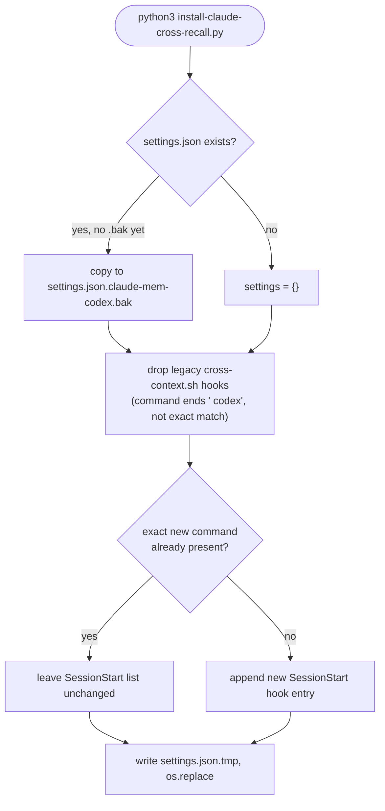

# Claude Code cross-recall installer

`plugins/claude-mem-codex/scripts/install-claude-cross-recall.py` is a standalone script (not part
of the Codex plugin loading path) that adds the Claude Code half of cross-recall: a
`SessionStart` hook that calls `claude-mem-cross-context.sh codex` so a Claude Code session also
loads Codex's memories. Run directly with `python3` — see
[quickstart.md](../quickstart.md#two-install-paths).

## `install(home, source)`

1. Copies `claude-mem-cross-context.sh` to `~/.claude/hooks/claude-mem-codex-cross-context.sh` and
   makes it executable (`chmod +x`).
2. If `~/.claude/settings.json` exists, backs it up once to
   `settings.json.claude-mem-codex.bak` — only if that backup doesn't already exist, so re-running
   the installer never overwrites the original pre-install state.
3. Removes any **legacy** cross-recall hook: an entry whose command contains
   `claude-mem-cross-context.sh`, ends with `" codex"`, and does not exactly match the new
   absolute-path command. This migrates hooks left behind by an older install layout without
   creating a duplicate. (Added in
   [6e0c92c](https://github.com/teamnebula-ai/claude-mem-codex/commit/6e0c92c) "fix: migrate
   legacy cross-recall hooks".)
4. Appends the new hook (`"<hook_path>" codex`, 60s timeout) to the `SessionStart` hook list only
   if a hook with that *exact* command string isn't already present — this is what makes repeated
   installs idempotent rather than additive.
5. Writes `settings.json` via a temp-file-then-`os.replace` swap, so a crash mid-write can't leave
   a truncated `settings.json`.

Every other `SessionStart` hook group (e.g. `existing-hook` in the test fixture) is left
untouched — the script only ever filters/appends within the hook list, never rewrites the whole
file wholesale.

## `uninstall(home)`

Removes any `SessionStart` hook whose command contains the hook filename
(`claude-mem-codex-cross-context.sh`), rewrites `settings.json`, and deletes the hook file itself
(`missing_ok=True`, so uninstalling twice is safe). Invoked with
`python3 .../install-claude-cross-recall.py --uninstall`
([README.md](../README.md#enable-claude-code--codex-cross-recall)).

## Relationships

- **verifies against** [workflows/hook-lifecycle.md](hook-lifecycle.md) — the hook this script
  installs is one of the `SessionStart` entries in that page's event table.
- **tested by** [operations/testing-and-checks.md](../operations/testing-and-checks.md) —
  `test_install_is_idempotent_and_uninstall_preserves_other_hooks` exercises exactly this
  install → install → uninstall sequence.
